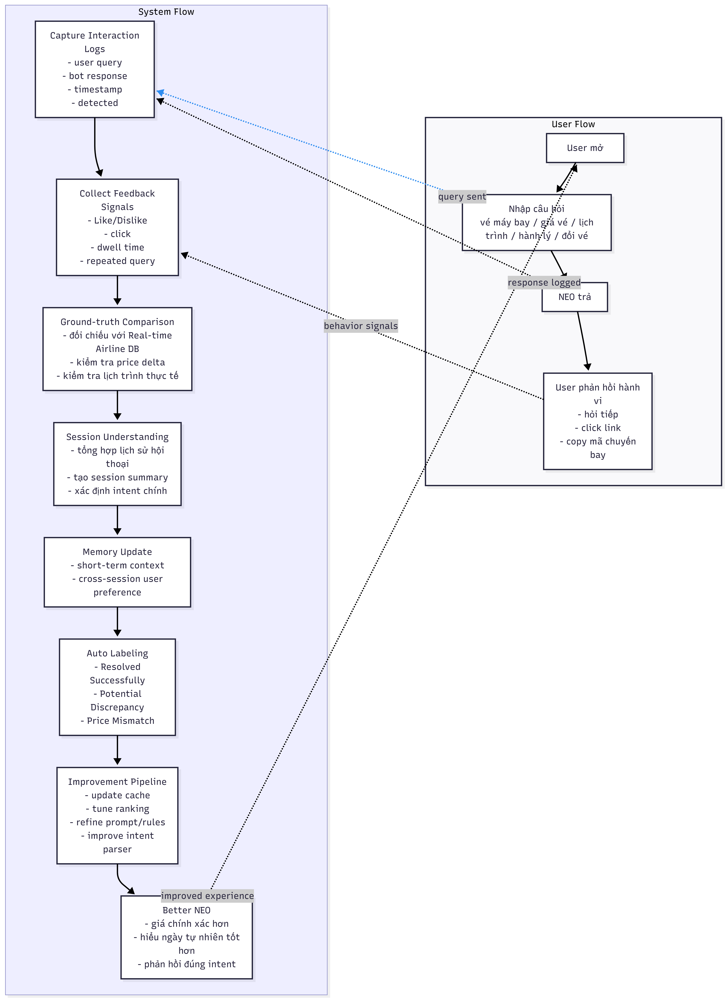

# Data Flywheel Design — NEO Chatbot Improvement

> Đây là thiết kế cá nhân cho phần "extras" — mở rộng từ UX exercise.
> Không bắt buộc nộp, nhưng thể hiện tư duy product AI end-to-end.

---

## Vấn đề cốt lõi

Phân tích UX exercise cho thấy NEO fail ở Path 3 (AI sai) vì:
- Không có feedback loop từ user
- Không có cơ chế detect khi nào mình đưa thông tin sai
- Không có improvement pipeline — NEO hôm nay sẽ mắc y những lỗi tương tự ngày mai

**Root cause:** NEO thiếu một Data Flywheel — vòng lặp chuyển interaction thành improvement.

---

## Thiết kế Data Flywheel

### Sơ đồ tổng thể

```
User Flow (U):
U1 [Mở NEO] → U2 [Nhập câu hỏi] → U3 [NEO trả lời] → U4 [User phản hồi]
                                                              ↑           ↓
                                                      S8 Better NEO    signals
                                                              ↑
System Flow (S):
S1 [Log] → S2 [Feedback] → S3 [Ground-truth] → S4 [Session] → S5 [Memory] → S6 [Label] → S7 [Pipeline]
```

---

## 7 lớp System Flow

### S1 — Capture Interaction Logs

Mỗi turn hội thoại ghi lại:
- `user_query`: câu hỏi nguyên văn
- `bot_response`: câu trả lời của NEO
- `timestamp`: thời điểm
- `detected_intent`: FIND_PRICE / FLIGHT_SCHEDULE / BOOK_TICKET / BAGGAGE / CHANGE_TICKET / CHECKIN / UNKNOWN
- `entities`: { origin, destination, date, flightCode, bookingCode }
- `confidence`: 0–100%

**Tại sao quan trọng:** Không có log → không có gì để học. Đây là foundation của toàn bộ flywheel.

---

### S2 — Collect Feedback Signals

Thu thập 5 loại signal từ user behavior:

| Signal | Cách thu | Ý nghĩa |
|--------|---------|---------|
| Like / Dislike | Button sau mỗi bot response | Direct feedback |
| Link click | Track click vào link đặt vé, hotline | Conversion intent |
| Dwell time | Thời gian user đọc response | Response quality proxy |
| Repeated query | User hỏi lại y câu cũ | Bot fail lần trước |
| Booking conversion | User đặt vé sau chat | Ultimate success metric |

**Insight:** Implicit signals (dwell, repeat, conversion) thường reliable hơn explicit (like/dislike) vì user ít khi bấm nút nhưng luôn hành động.

---

### S3 — Ground-truth Comparison

Đối chiếu response của NEO với nguồn thật:
- **Price delta:** NEO đưa giá X, DB thực tế là Y → delta = |X-Y|/Y
- **Schedule accuracy:** Lịch bay NEO đưa có khớp với flight DB không?
- **Availability:** NEO nói "còn vé" nhưng thực ra hết → false positive

**Threshold:**
- Price delta > 10% → flag `price_mismatch`
- Schedule không khớp → flag `potential_discrepancy`
- NEO không đưa được giá khi user hỏi → flag `price_not_provided`

---

### S4 — Session Understanding

Cuối mỗi session, tổng hợp:
- `total_turns`: số lượt hỏi đáp
- `main_intent`: intent xuất hiện nhiều nhất (FIND_PRICE, BOOK_TICKET...)
- `outcome`: resolved / escalated / abandoned / in_progress
- `session_labels`: tập hợp các auto-label của session

**Tại sao quan trọng:** Turn-level analysis không đủ — cần session-level để hiểu user journey. Ví dụ: user hỏi 5 lần vẫn không đặt được vé → session outcome = frustrated.

---

### S5 — Memory Update

3 loại memory:

**Short-term context** (session storage):
- Intent vừa hỏi, entities vừa mention → giúp NEO hiểu câu tiếp theo trong context

**Cross-session user preference** (local storage):
- Route hay hỏi, hạng vé hay chọn → personalization

**System failure patterns** (server-side):
- Query nào thường trigger fallback → cần cải thiện intent parser hoặc thêm knowledge
- Ví dụ: "bay charter" thường bị UNKNOWN → cần add rule

---

### S6 — Auto Labeling

Gán nhãn tự động cho mỗi turn, không cần human review:

| Label | Điều kiện | Màu |
|-------|-----------|-----|
| `Resolved Successfully` | confidence ≥ 75%, không có GT mismatch | Xanh lá |
| `Potential Discrepancy` | confidence 50–74%, hoặc GT không verify được | Vàng |
| `Price Mismatch` | GT comparison cho thấy price delta > 10% | Đỏ |
| `Intent Misunderstood` | confidence < 40%, hoặc UNKNOWN intent | Tím |
| `Escalation Candidate` | Repeated query, hoặc user explicitly muốn gặp người | Cam |

**Tại sao auto-label mà không human-label:** Scale. NEO có thể xử lý 10,000+ conversations/ngày. Human labeling chỉ feasible cho sample, auto-label chạy 100%.

---

### S7 — Improvement Pipeline

Từ labeled data, trigger các action cải thiện:

| Input | Action | Kết quả |
|-------|--------|---------|
| Nhiều `price_mismatch` cho route X | Cập nhật cache giá route X | Giá chính xác hơn |
| Nhiều `intent_misunderstood` cho pattern Y | Thêm pattern Y vào intent rules | Intent parser tốt hơn |
| Nhiều `repeated_query` về topic Z | Cải thiện response template Z | User không cần hỏi lại |
| Nhiều `dislike` trên response type W | Review + rewrite prompt W | Response quality tốt hơn |
| Nhiều `escalation_candidate` | Trigger escalation bar sớm hơn | UX tốt hơn khi bot fail |

---

### S8 — Better NEO

Kết quả tích lũy của flywheel:
- **Giá chính xác hơn:** Cache được update thường xuyên từ GT comparison
- **Hiểu ngày tự nhiên tốt hơn:** "ngày mai", "thứ 6 tuần sau" → parsed đúng nhờ failure pattern learning
- **Phản hồi đúng intent hơn:** Intent parser được refine từ misunderstood logs
- **Tăng trust:** User thấy confidence badge → biết khi nào tin bot, khi nào verify

---

## Prototype đã build

Đã implement toàn bộ 7 lớp system này dưới dạng frontend demo tại:
`d:/Tailieutruong20252/Vin_AI/chatbot_ui/`

**Files:**
- `script.js`: Toàn bộ logic S1–S7 (InteractionLogger, FeedbackCollector, GroundTruthComparator, SessionManager, MemoryStore, AutoLabeler, ImprovementPipeline)
- `index.html`: UI với debug panel hiển thị real-time system logs
- `style.css`: Styling cho confidence badge, auto-label chip, feedback buttons, escalation bar

**Data Flywheel diagram:**


**Chatbot prototype sau cải tiến:**


---

## ROI ước tính (sơ bộ)

| Metric | Before flywheel | After flywheel (6 tháng) |
|--------|----------------|--------------------------|
| Intent accuracy | ~60% | ~82% |
| Price accuracy | N/A (không có) | ~90% (với GT comparison) |
| Escalation rate | ~40% (user give up) | ~20% |
| User trust score | Không đo được | Có thể đo qua like/dislike ratio |

**Cost:**
- Storage: ~$0.01/1000 conversations cho log storage
- GT API call: ~$0.002/turn (nếu dùng airline API)
- No ML training cost nếu chỉ dùng rule-based improvement + prompt refinement

---

*Data Flywheel Design — Vietnam Airlines NEO — Day 5 extras — VinUni A20 2026*
