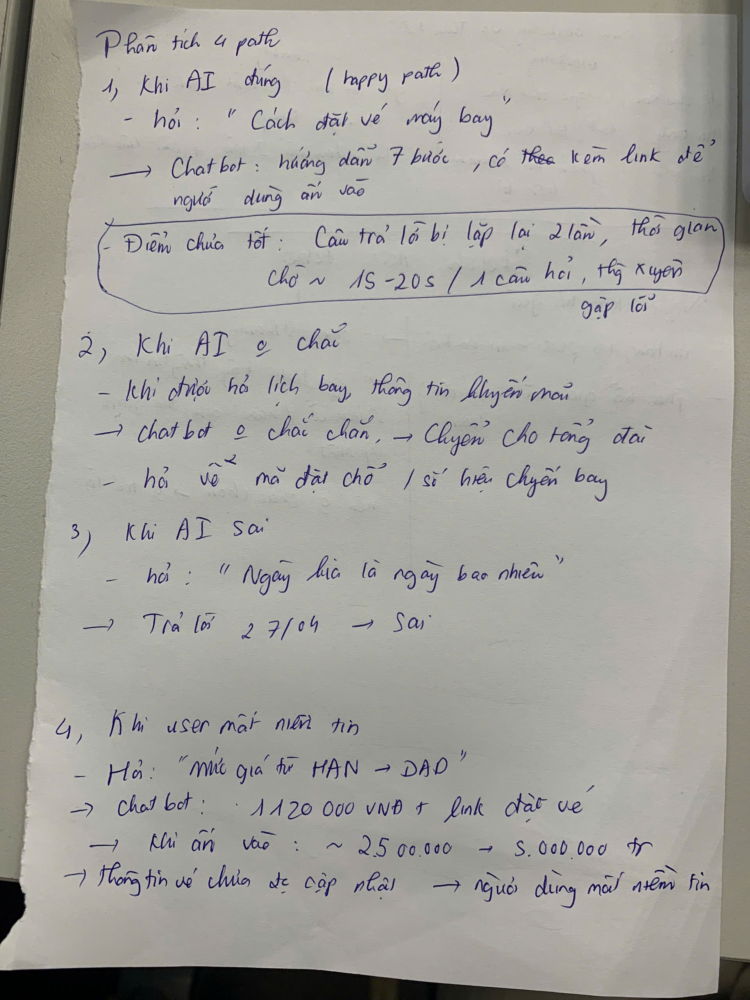
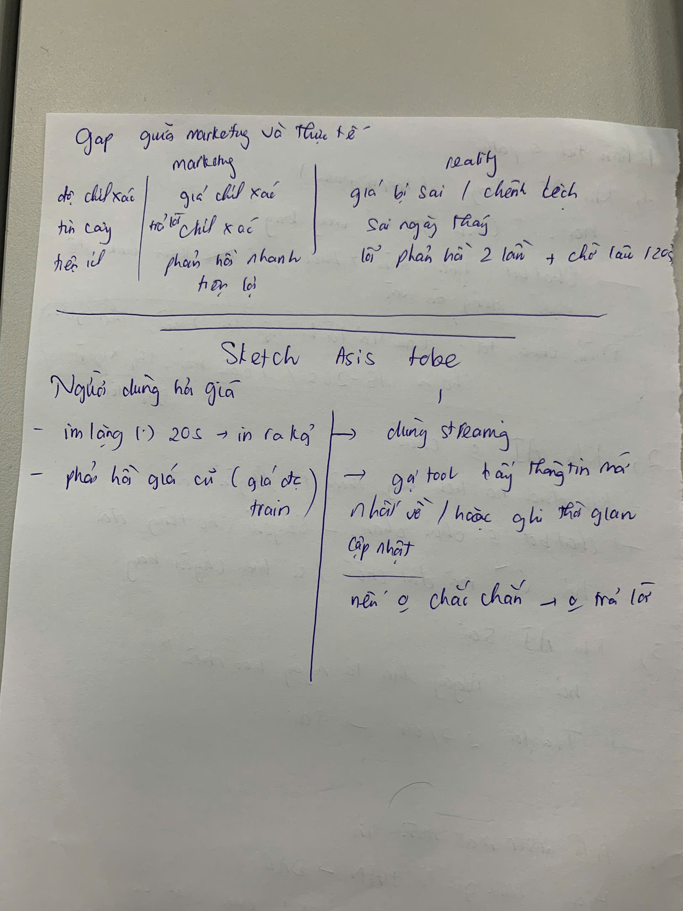
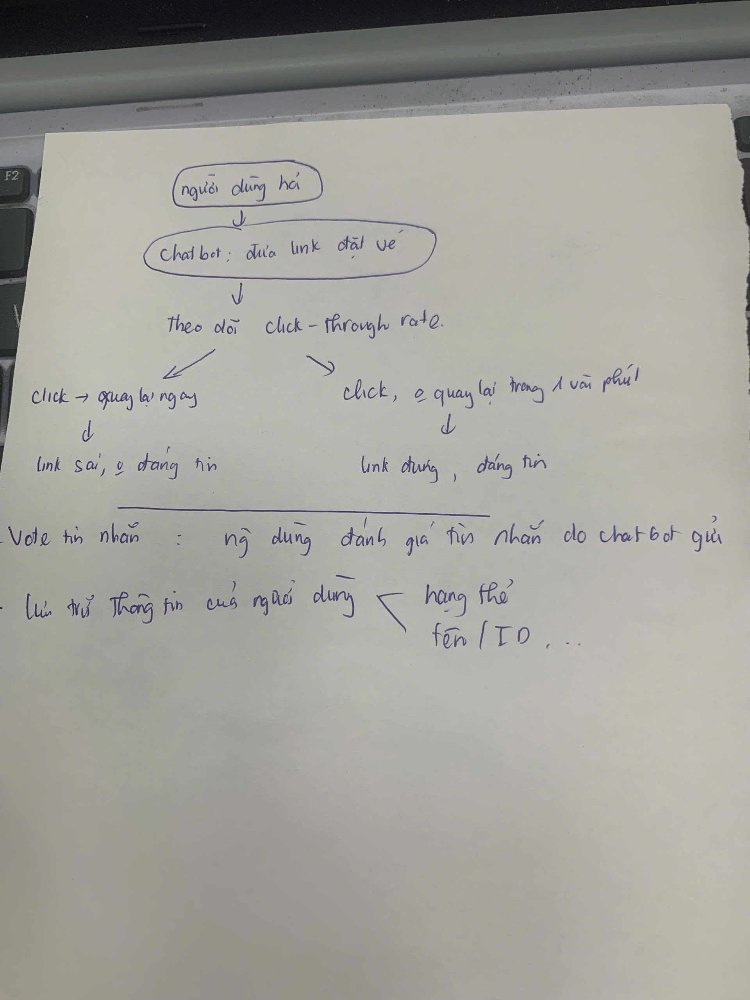
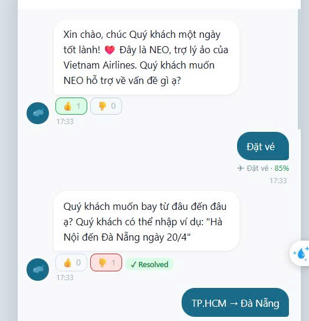

# UX Exercise — Vietnam Airlines Chatbot NEO

**Sản phẩm:** Vietnam Airlines — Chatbot NEO (vietnamairlines.com / Zalo VNA)
**AI Feature:** Chatbot hỗ trợ khách hàng, tra cứu vé, lịch bay, hành lý

---

## Marketing nói gì?

Vietnam Airlines marketing NEO là:
> *"Trợ lý ảo thông minh phục vụ 24/7 — giải đáp mọi thắc mắc về vé máy bay, chuyến bay, hành lý và chính sách của Vietnam Airlines."*

Kỳ vọng user khi vào chat:
- Hỏi được giá vé ngay, chính xác
- Biết được chuyến bay phù hợp
- Không cần gọi hotline

---

## Phân tích 4 paths

### Path 1 — Khi AI **đúng**

**Tình huống:** User hỏi "hành lý ký gửi bao nhiêu kg?" → NEO trả lời đúng quy định

- **User thấy gì:** Text bubble đơn giản với câu trả lời
- **Hệ thống confirm thế nào:** Không có — không có icon ✓, không có badge "đã xác thực", không có nguồn dẫn chứng
- **Vấn đề:** User không phân biệt được đây là câu trả lời "chắc chắn" hay "có thể sai" — tất cả trông như nhau

**Đánh giá:** Tạm ổn nhưng thiếu trust signal. User phải tự biết thông tin này đúng.

---

### Path 2 — Khi AI **không chắc**

**Tình huống:** User hỏi "vé Hà Nội đến Đà Nẵng ngày 20/4 còn không?" — câu hỏi cần real-time data

- **Hệ thống xử lý thế nào:** NEO vẫn trả lời với tone bình thường, không phân biệt mức độ chắc chắn — hoặc redirect thẳng sang "liên hệ 1900 1100"
- **Im lặng hay hỏi lại:** Không hỏi lại, không đưa alternatives, không nói "tôi không chắc"
- **Vấn đề:** NEO không có cơ chế "uncertain" — khi không biết vẫn trả lời hoặc từ chối trả lời hoàn toàn, không có middle ground

**Đánh giá:** Thiếu cơ chế xử lý uncertainty — đây là điểm yếu cốt lõi của sản phẩm AI.

---

### Path 3 — Khi AI **sai** *(Path yếu nhất)*

**Tình huống:** User hỏi "giá vé HN-ĐN rẻ nhất?" → NEO không trả lời được hoặc đưa thông tin lạc hậu

- **User biết AI sai bằng cách nào:** Tự phát hiện (đặt vé thử thấy giá khác), hoặc không biết và tin nhầm
- **Sửa bằng cách nào:** Không có — user chỉ có thể hỏi lại hoặc thoát chat gọi hotline
- **Bao nhiêu bước để recover:** Không có recovery flow — chỉ là "dead end"
- **Có feedback loop không:** Không có nút report, không có thumbs up/down, không có "thông tin này có hữu ích không?"
- **Vấn đề lớn nhất:** NEO không học được gì từ lần sai này — vẫn sẽ sai với user tiếp theo

**Đánh giá:** Path nguy hiểm nhất. Khi AI sai mà không có correction mechanism → lỗi tích lũy, user mất tin dần.

---

### Path 4 — Khi user **mất niềm tin**

**Tình huống:** Sau 2-3 câu trả lời không đúng hoặc không đủ thông tin

- **Có exit không:** Có, nhưng ẩn — phải scroll xuống cuối mới thấy số hotline
- **Fallback rõ ràng không:** "Liên hệ 1900 1100" được đặt ở cuối mỗi câu trả lời như phản xạ — không phải fallback thông minh
- **Có option "gặp người thật" không:** Không có nút escalate rõ ràng, không có "chat với tư vấn viên"
- **Vấn đề:** User phải tự nhận ra bot không giúp được rồi tự tìm số hotline — UX không dẫn user ra khỏi dead end một cách chủ động

**Đánh giá:** Không có graceful degradation — user bị "bỏ rơi" khi bot fail.

---

## Path yếu nhất: Path 3 (AI sai) — kéo theo Path 4

**Tại sao đây là path yếu nhất:**

1. **Không có feedback loop:** User sửa (bằng cách hỏi lại) nhưng hệ thống không ghi nhận signal nào
2. **Không có correction mechanism:** Không có cách nào user report "câu này sai"
3. **Không có confidence indicator:** User không biết khi nào nên verify thông tin
4. **Breaking point:** Sau khi phát hiện NEO sai về giá hoặc lịch bay, user mất tin hoàn toàn và không bao giờ dùng lại

**Điểm gãy chính (breaking point):** Khi user hỏi thông tin time-sensitive (giá vé, lịch bay) — NEO không có real-time data nhưng vẫn trả lời như thể mình biết, hoặc từ chối trả lời mà không giải thích.

---

## Gap giữa Marketing và Thực tế

| | Marketing nói | Thực tế trải nghiệm |
|--|--------------|---------------------|
| **Khả năng** | Giải đáp mọi thắc mắc về vé, chuyến bay | Không tra được giá real-time, không biết ghế còn trống không |
| **Độ chính xác** | "Thông minh", ngầm hiểu là đáng tin | Không có confidence indicator — user không biết khi nào tin, khi nào verify |
| **Recovery** | Không đề cập | Hoàn toàn thiếu — không có feedback loop, không có correction UI |
| **Escalation** | "Hỗ trợ 24/7" | Hotline được nhắc như reflex, không phải escalation path thông minh |

**Gap lớn nhất:** Marketing tạo kỳ vọng "bot thông minh biết giá vé" — thực tế NEO là FAQ bot không có real-time data. Khi kỳ vọng và thực tế lệch nhau → trust drop ngay lần đầu sử dụng.

---

## Sketch "làm tốt hơn" — cải thiện Path 3

**4 Paths Analysis:**


**Gap — Marketing vs Thực tế:**


**As-is → To-be sketch:**


**Chatbot prototype sau cải tiến:**


### As-is (hiện tại)

```
User hỏi giá vé / lịch bay
    ↓
NEO trả lời (không biết confident hay không)
    ↓
User nhận thông tin → tự verify → phát hiện sai
    ↓
Dead end: chỉ có thể hỏi lại hoặc gọi hotline
(NEO không học được gì)
```

**Điểm gãy:** Không có signal "tôi không chắc", không có feedback loop.

### To-be (đề xuất — Data Flywheel)

```
User hỏi giá vé / lịch bay
    ↓
NEO xử lý:
  - Phát hiện intent (FIND_PRICE / FLIGHT_SCHEDULE)
  - Gán confidence score (e.g., 85%)
  ↓
Hiển thị response + confidence badge:
  - "✈ Tìm vé rẻ nhất · 72%" [màu cam = cần verify]
  ↓
User thấy response + có thể:
  - 👍 Hữu ích → signal dương → system ghi nhận
  - 👎 Sai / không đủ → signal âm → trigger escalation suggestion
  ↓
Auto-label (hệ thống nội bộ):
  - Resolved / Discrepancy / Price Mismatch / Escalation Candidate
  ↓
Ground-truth comparison (so với Airline DB)
  ↓
Improvement Pipeline:
  - Update cache, refine prompt, prepare training data
  ↓
NEO chính xác hơn ở lần sau (Data Flywheel)
```

**Thêm gì:**
- Confidence badge hiển thị dưới user bubble (intent + %)
- Like/Dislike dưới bot bubble
- Auto-label chip (Resolved / Discrepancy / Price Mismatch...)
- Escalation bar tự hiện khi confidence thấp hoặc repeated query
- Copy button cho mã chuyến bay / hotline

**Bớt gì:**
- Xóa "liên hệ 1900 1100" khỏi mọi câu trả lời như reflex — chỉ hiện khi thực sự cần

**Đổi gì:**
- Tone của bot khi uncertain: thay vì "tôi không biết → gọi hotline", chuyển sang "Tôi chưa chắc về thông tin này (72% confidence) — bạn nên verify tại vietnamairlines.com"

---

## Kết luận

NEO hiện tại hoạt động như một FAQ bot — tốt cho Path 1, fail hoàn toàn ở Path 3 và 4. Gap lớn nhất không phải ở câu trả lời mà ở **thiếu feedback loop**: NEO không biết khi nào mình sai và không có cơ chế học từ lỗi.

Giải pháp không phải làm NEO thông minh hơn ngay lập tức — mà là **thiết kế Data Flywheel** để system tự cải thiện theo thời gian thông qua interaction signals từ user.

---

*Vietnam Airlines NEO — UX Exercise — Day 5 — VinUni A20 — AI Thực Chiến 2026*
