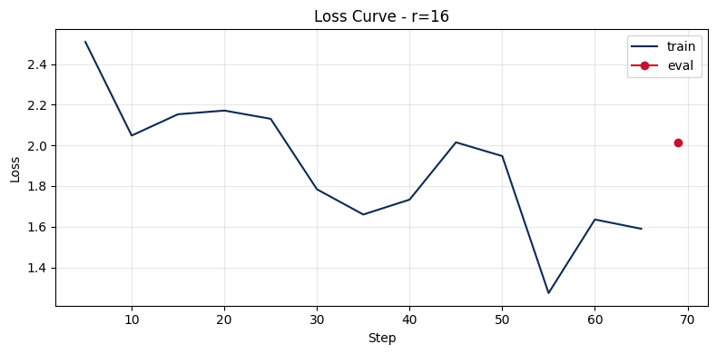

# Lab 21 - Evaluation Report

**Student**: Dao Van Son - TODO student ID  
**Submission date**: TODO  
**Submission option**: B - GitHub + HuggingFace Hub (+5 bonus)

## 1. Setup

- **Base model**: `unsloth/Llama-3.2-3B-Instruct-bnb-4bit`
- **Dataset**: `gbharti/finance-alpaca`; 200 samples used from 68,911 valid rows after filtering, split into 180 train and 20 eval examples with seed 42
- **Data format**: Alpaca-style `instruction`, `input`, `output`
- **Token statistics**: min = 24, p50 = 90, p95 = 322, p99 = 739, max = 1913
- **max_seq_length**: 512, selected by rounding p95 up to a power of two, capped at 1024
- **GPU**: Tesla T4, 15.6 GB VRAM; CUDA 12.8; PyTorch 2.10.0+cu128
- **Libraries**: Unsloth 2026.5.2, TRL 0.15.2, Transformers 5.5.0
- **Training config**: 3 epochs, learning rate = 2e-4, cosine scheduler, warmup ratio = 0.10, effective batch size = 8, optimizer = `adamw_8bit`, fp16 = True, eval-during-training = off
- **LoRA target modules**: `q_proj`, `k_proj`, `v_proj`, `o_proj`, `gate_proj`, `up_proj`, `down_proj`
- **Training cost estimate**: $0.06 for 9.7 minutes total training time at $0.35/hour T4 estimate
- **HuggingFace profile**: https://huggingface.co/daosonn
- **Expected adapter repo**: https://huggingface.co/daosonn/lab21-llama32-3b-finance-alpaca-lora-r16

Note: the notebook attempted to push to HuggingFace Hub, but the first push failed because `HF_USERNAME` was set to the full URL (`https://huggingface.co/daosonn`) instead of the namespace (`daosonn`). The correct repo id format is `daosonn/lab21-llama32-3b-finance-alpaca-lora-r16`.

## 2. Rank Experiment Results

| Rank | Alpha | Trainable Params | Train Time | Peak VRAM | Eval Loss | Perplexity |
|------|-------|------------------|------------|-----------|-----------|------------|
| Base | - | 0 | - | - | NaN | NaN |
| 8 | 16 | 12,156,928 | 2.93 min | 5.73 GB | 1.9990 | 7.38 |
| 16 | 32 | 24,313,856 | 3.59 min | 5.06 GB | 2.0142 | 7.49 |
| 64 | 128 | 97,255,424 | 3.22 min | 7.40 GB | 2.2037 | 9.06 |

The base-model perplexity is recorded as `NaN` because the evaluation helper attempted to instantiate a `Trainer` on a purely quantized base model without trainable adapters, which Transformers rejected. The three LoRA adapters were evaluated successfully on the same eval set.

## 3. Loss Curve Analysis

The r=16 training loss generally decreased from 2.51 at step 5 to 1.59 at step 65, with some fluctuations around steps 20-50. Because evaluation during training was disabled to avoid T4 out-of-memory errors, the loss curve mostly shows training loss, not validation loss. The final eval perplexity gives a clearer rank comparison: r=8 achieved the best perplexity (7.38), r=16 was very close (7.49), and r=64 was worse (9.06). The r=64 training loss fell much more aggressively, down to 0.96 near the end, but its eval perplexity was the worst. That pattern suggests overfitting or excess adapter capacity for a small 200-sample subset.

## 4. Qualitative Comparison (5 examples)

### Example 1
**Prompt**: Explain the difference between APR and APY in simple terms.

**Base**: APR is the rate of interest charged by a lender on a loan. APY is the rate of return of an investment, including compounding frequency and fees.

**Fine-tuned (r=16)**: APR is the interest rate charged on a loan. APY is the interest rate that a savings account earns, and it takes compounding into account.

**Comment**: Improved. The fine-tuned answer is simpler and more beginner-friendly, with a clearer contrast between borrowing cost and savings yield.

### Example 2
**Prompt**: When should someone prioritize paying off high-interest debt over investing?

**Base**: High-interest debt should be prioritized because the interest consumes money that could otherwise be earned in the market.

**Fine-tuned (r=16)**: High-interest debt should be paid off because it is costing money; paying it down stops interest from accumulating sooner.

**Comment**: Same to slightly improved. Both answers are correct; the fine-tuned answer is more direct and conversational, but it does not add a specific rate threshold.

### Example 3
**Prompt**: What are the main risks of buying options close to expiration?

**Base**: The option may expire worthless, lose value, or require paying a higher price to close the position.

**Fine-tuned (r=16)**: The main risks are expiration worthless and possible assignment; if the option expires worthless, the buyer loses the full premium paid.

**Comment**: Improved. The fine-tuned answer uses more finance-specific terminology and explicitly mentions premium loss.

### Example 4
**Prompt**: How does diversification reduce portfolio risk?

**Base**: Diversification spreads risk across assets such as stocks and bonds, reducing the risk of any one investment becoming worthless.

**Fine-tuned (r=16)**: Diversification spreads risk across stocks, bonds, and commodities; if one asset performs poorly, others can offset the loss.

**Comment**: Improved. The fine-tuned response explains the offsetting mechanism more clearly.

### Example 5
**Prompt**: Explain capital gains tax at a high level for a new investor.

**Base**: Capital gains tax is a tax on investment profits; it is usually a percentage of the gain and may be tax-free after holding over a year.

**Fine-tuned (r=16)**: Capital gains tax is imposed on profits from selling an investment and is based on the difference between sale price and original purchase price.

**Comment**: Improved. The fine-tuned answer avoids an overbroad tax-free claim and explains the basic calculation more accurately.

## 5. Conclusion on Rank Trade-off

On the 200-sample Finance Alpaca subset, rank r=8 gives the best return on investment. It has the lowest eval perplexity (7.38), the shortest training time (2.93 minutes), and the fewest trainable parameters among the three adapters. Rank r=16 is still a strong balanced option, with perplexity 7.49, but in this experiment it did not improve over r=8. Rank r=64 has much larger capacity (97.3M trainable parameters) and much lower training loss, but its eval perplexity is the worst (9.06). This is a clear diminishing-returns signal: increasing LoRA rank increases the capacity of the low-rank update, but with a small dataset it can learn noise or overly specific patterns instead of improving generalization. For production deployment on this finance QA task, I would choose r=8 for cost/quality efficiency. If I wanted a safer default that is easier to justify as a common baseline, I would choose r=16.

## 6. What I Learned

- A larger LoRA rank is not automatically better; eval perplexity and qualitative behavior matter more than training loss alone.
- With QLoRA 4-bit and Unsloth, a 3B model can be fine-tuned on a T4 using roughly 5-7.4 GB peak VRAM for these adapter settings.
- Dataset size and quality strongly affect rank selection: with 200 finance examples, a smaller adapter such as r=8 was enough to learn useful domain behavior and was less prone to overfitting than r=64.
